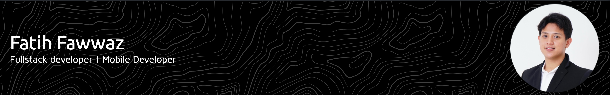

I'm a final-year Computer Science student at **BINUS University, Indonesia**, with a strong passion for Software Engineering. I am an enthusiast of both **Full Stack** and **Mobile Development**. Currently, I am expanding my skills in Apple technologies through an apprenticeship at the **Apple Developer Academy**.

- 🔭 I’m currently working on enhancing my iOS development skills.
- 🌱 I’m currently learning everything about SwiftUI and other Apple frameworks.
- 👯 I’m looking to collaborate on open-source projects related to mobile or web development.
- 💬 Ask me about my tech stack or my journey in tech!

---

### 🔧 My Tech Stack

---

### 📊 My GitHub Stats

---

### 🌐 Connect with Me

<!--  -->

